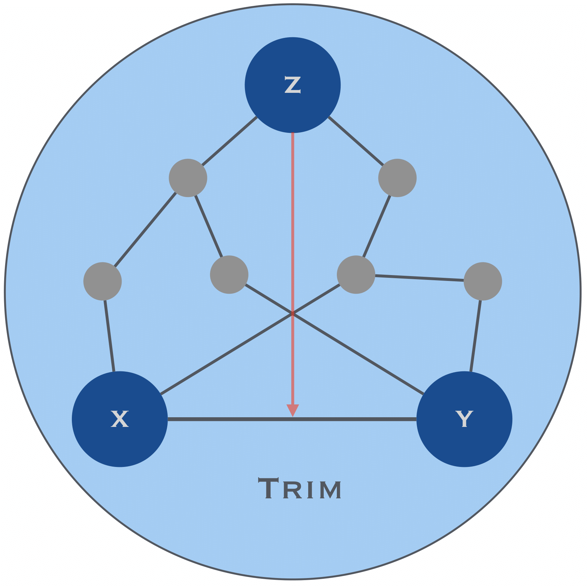
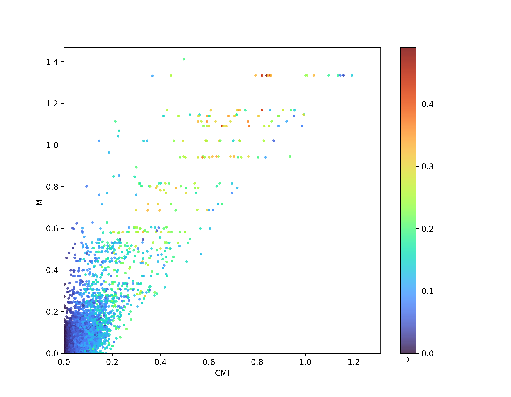
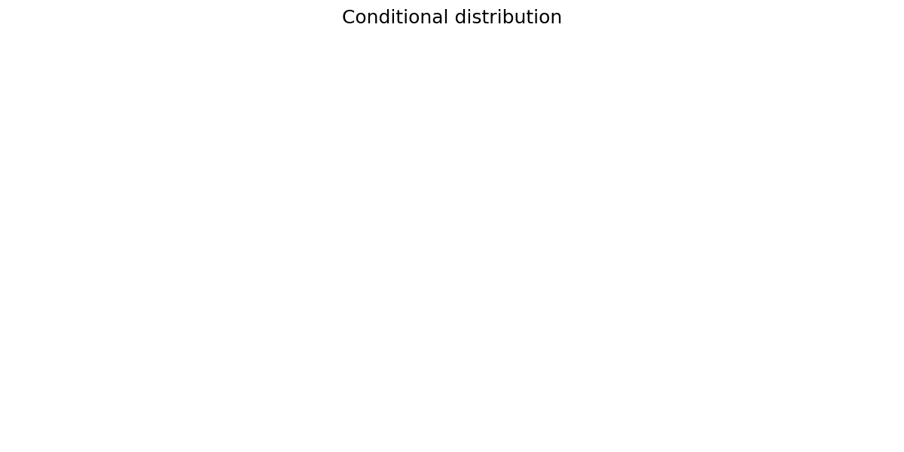

=============================================================================================
Trim : Python code for triadic interactions
=============================================================================================

⚠️ Trim is the v2 of Triaction (https://github.com/anthbapt/triaction) which includes updates and quality of life improvements

This repository contains the Python package called trim, which enables the detection of triadic interactions. It also provides visualisation capabilities to visualise triadic interaction network.

The package has been created by Anthony Baptista, Marta Niedostatek and Ginestra Bianconi, with the help of Jun Yamamoto.

arXiv link to the preprint: https://arxiv.org/abs/2404.14997

Trim is the latest version of the Triaction package: https://github.com/anthbapt/triaction

-----------------
 Installation
-----------------

.. code-block:: bash    

  $ python setup.py install

-----------------
Data
-----------------

``Continuous data``:
 * Gene expression

---------------------------------------------------
Gene expression of Acute Myeloid Leukemia (AML)
---------------------------------------------------

Scatter plot of the results of the Trim algorithm on AML gene expression data. Each data point shows the information-theoretic measures for a triple of nodes $X$, $Y$ and $Z$, namely MI and CMI, the mutual information and conditional mutual information between $X$ and $Y$, respectively. The colour of each point corresponds to the value of :math:`\Sigma` , which characterises the strength of the triadic interaction between gene $Z$ and the edge between $X$ and $Y$.

.. code-block:: Python  

   import numpy as np
   import pandas as pd
   from trim.analysis import decision_tree, visualisation_conditioned_val
   from trim.infocore import Theta_score_null_model

   # Load gene expression data
   gene_expression = pd.read_csv('../data/reduce_gene_expression.tsv', sep = '\t', index_col=0)

   # Select genes of interest
   name_X = 'GATA1'
   name_Y = 'TAL1'
   name_Z = 'KLF5'

   # Prepare time series data
   X = np.array(gene_expression.T[name_X])
   Y = np.array(gene_expression.T[name_Y])
   Z = np.array(gene_expression.T[name_Z])

   timeseries = np.zeros((3,len(X)))
   timeseries[0,:] = X
   timeseries[1,:] = Y
   timeseries[2,:] = Z

   # Parameters for Theta score calculation
   I = [0,1,2]
   num = 5
   tlen = len(X)
   nrunmax = 1000

   # Calculating Theta scores
   MI, MIz, MIz_null, MIC, Theta_S, Theta2_T, Theta2_Tn, Sigma, Sigma_null_list, P, P_T, P_Tn = Theta_score_null_model(timeseries, I, num, tlen, nrunmax, True, True)

   # Calculating decision tree thresholds
   x = np.arange(1, num+1)
   th1,th2,c = decision_tree(x, MIz, disp_fig=True, disp_txt_rep=True, disp_tree=True)

   # Visualisation
   visualisation_conditioned_val(timeseries, I, num, tlen, name=None, cond = [th1,th2])

